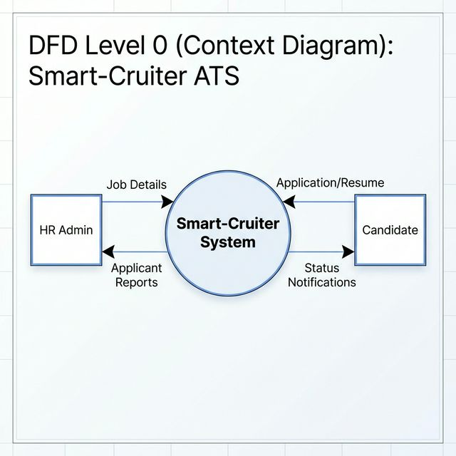
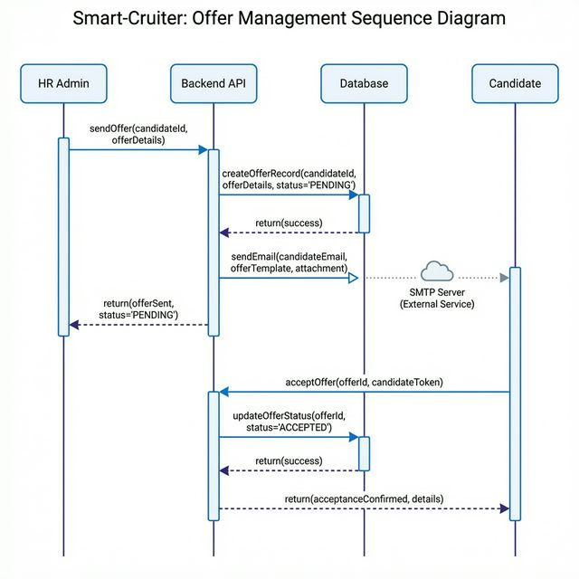
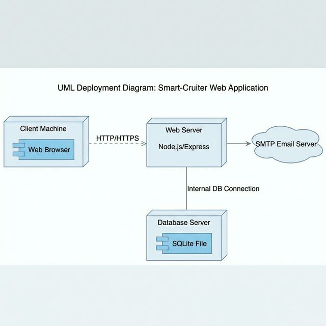

## CHAPTER 5: SYSTEM DESIGN (Detailed)

### 5.1 High-Level System Architecture

Smart-Cruiter follows a **Three-Tier Architecture** pattern, which is the industry standard for modern web applications. The three tiers are:

1. **Presentation Tier (Client):** The React.js frontend application that runs in the user's web browser. It handles all user interface rendering, user interactions, form validations, and client-side routing. The presentation tier communicates with the logic tier exclusively through HTTP requests.

2. **Logic Tier (Server):** The Node.js/Express.js backend application that processes business logic, handles API requests, manages database operations, and orchestrates the email dispatch service. This tier exposes RESTful API endpoints that the client consumes.

3. **Data Tier (Database):** The SQLite relational database that persists all application data — jobs, applicants, interviews, employees, notifications, and application history. The data tier is accessed exclusively through the logic tier using parameterised SQL queries.


*Figure 5.1: High-Level Three-Tier System Architecture of Smart-Cruiter*

**Architecture Flow:**

```
┌─────────────────────────────────────────────────────────────────┐
│                    PRESENTATION TIER                             │
│  ┌───────────┐  ┌──────────────┐  ┌────────────────────────┐   │
│  │ HR Portal │  │ Career Page  │  │ Candidate Portal       │   │
│  │ (React)   │  │ (React)      │  │ (React)                │   │
│  └─────┬─────┘  └──────┬───────┘  └────────────┬───────────┘   │
│        │               │                        │               │
│        └───────────────┼────────────────────────┘               │
│                        │  Axios HTTP Requests                   │
└────────────────────────┼────────────────────────────────────────┘
                         │
                    ┌────▼────┐
                    │  CORS   │
                    │Middleware│
                    └────┬────┘
                         │
┌────────────────────────┼────────────────────────────────────────┐
│                    LOGIC TIER                                    │
│  ┌──────────────────────────────────────────────────────────┐   │
│  │              Express.js REST API Server                   │   │
│  │  ┌─────────┬───────────┬────────────┬──────────────────┐ │   │
│  │  │ /jobs   │/applicants│/interviews │ /notifications   │ │   │
│  │  │ Routes  │ Routes    │ Routes     │ Routes           │ │   │
│  │  ├─────────┼───────────┼────────────┼──────────────────┤ │   │
│  │  │/emails  │/analytics │/employees  │ /history         │ │   │
│  │  │ Routes  │ Routes    │ Routes     │ Routes           │ │   │
│  │  └─────────┴───────────┴────────────┴──────────────────┘ │   │
│  │                        │                                  │   │
│  │              ┌─────────▼──────────┐                       │   │
│  │              │  Email Service     │                       │   │
│  │              │  (Nodemailer/SMTP) │                       │   │
│  │              └────────────────────┘                       │   │
│  └──────────────────────────────────────────────────────────┘   │
│                        │  Parameterised SQL Queries              │
└────────────────────────┼────────────────────────────────────────┘
                         │
┌────────────────────────┼────────────────────────────────────────┐
│                    DATA TIER                                     │
│  ┌──────────────────────────────────────────────────────────┐   │
│  │                  SQLite Database                          │   │
│  │  ┌──────┬───────────┬────────────┬────────────────────┐  │   │
│  │  │ jobs │applicants │ interviews │ employees          │  │   │
│  │  ├──────┼───────────┼────────────┼────────────────────┤  │   │
│  │  │      │notifications          │ application_history│  │   │
│  │  └──────┴───────────┴────────────┴────────────────────┘  │   │
│  └──────────────────────────────────────────────────────────┘   │
└─────────────────────────────────────────────────────────────────┘
```

### 5.2 Three-Tier Architecture Breakdown

**Presentation Tier Details:**

The frontend is a single-page application (SPA) built with React 18 and bundled using Vite. It uses the following key technologies:

| Component | Technology | Purpose |
|:----------|:-----------|:--------|
| UI Framework | React 18 (Functional Components) | Declarative component-based rendering |
| Language | TypeScript | Type-safe development |
| Routing | React Router DOM v6 | Client-side URL routing |
| HTTP Client | Axios | Promise-based API communication |
| State Management | React Context API + useState | Global auth state + local component state |
| Charts | Recharts | Data visualisation (Bar charts) |
| Icons | Lucide React | SVG icon components |
| Date Handling | date-fns | Date formatting and distance calculations |
| PDF Generation | jsPDF + jspdf-autotable | Client-side PDF report export |
| Styling | Vanilla CSS with CSS Custom Properties | Glassmorphism design system |

**Logic Tier Details:**

| Component | Technology | Purpose |
|:----------|:-----------|:--------|
| Runtime | Node.js (v18+) | Server-side JavaScript execution |
| Framework | Express.js v4.18 | HTTP routing and middleware |
| Database Driver | sqlite3 v5.1 | SQLite database connectivity |
| Email Service | Nodemailer v6.9 | SMTP email dispatch |
| Unique IDs | UUID v9 (v4 variant) | Generate unique record identifiers |
| Configuration | dotenv v16 | Environment variable management |
| Middleware | cors, express.json() | Cross-origin requests, JSON parsing |

**Data Tier Details:**

- **Engine:** SQLite 3 (embedded, serverless, zero-configuration)
- **Storage:** Single file (`database.sqlite`) in the server directory
- **Tables:** 6 tables (jobs, applicants, interviews, employees, notifications, application_history)
- **Indexes:** 5 indexes for performance optimisation
- **Referential Integrity:** Foreign key constraints with ON DELETE CASCADE/SET NULL

### 5.3 Database Design & Schema

#### 5.3.1 Entity Relationship Diagram (ERD)

The ERD illustrates the relationships between the six primary entities in the Smart-Cruiter database:


*Figure 5.2: Entity Relationship Diagram of the Smart-Cruiter Database*

**Relationships:**

1. **Jobs ↔ Applicants (1:N):** One job can have many applicants. Each applicant is associated with exactly one job through the `job_id` foreign key. When a job is deleted, all associated applicants are cascaded (ON DELETE CASCADE).

2. **Applicants ↔ Interviews (1:N):** One applicant can have multiple interviews (e.g., screening round, technical round, HR round). Each interview references an applicant through `applicant_id`. Deletion cascades.

3. **Jobs ↔ Interviews (1:N):** Each interview is also associated with a job through `job_id`, enabling queries like "show all interviews for Job X".

4. **Applicants ↔ Employees (1:1):** When a candidate is hired, an employee record is created with a reference to the original `applicant_id`. SET NULL on applicant deletion preserves the employee record.

5. **Applicants → Notifications (via email):** Notifications are linked to applicants through the `recipient_email` field rather than a direct foreign key, allowing notifications to persist even if the applicant record is modified.

6. **Application History (Independent):** The `application_history` table stores immutable decision records. It is not directly foreign-keyed to `applicants` to ensure that history entries persist even if applicant records are deleted.

#### 5.3.2 Data Dictionary

**Table 5.1: Data Dictionary – Jobs Table**

| Attribute | Data Type | Constraints | Description |
|:----------|:----------|:------------|:------------|
| id | TEXT | PRIMARY KEY | UUID v4 unique identifier |
| title | TEXT | NOT NULL | Job designation title |
| department | TEXT | NULLABLE | Department (e.g., Engineering, Product) |
| location | TEXT | NULLABLE | Work location (e.g., Remote, New York) |
| type | TEXT | NULLABLE | Employment type (full-time, part-time, contract) |
| description | TEXT | NULLABLE | Detailed job description |
| requirements | TEXT | NULLABLE | Skills and qualifications required |
| status | TEXT | DEFAULT 'open' | Job posting status: open, closed, or draft |
| created_at | DATETIME | DEFAULT CURRENT_TIMESTAMP | Record creation timestamp |
| updated_at | DATETIME | DEFAULT CURRENT_TIMESTAMP | Last modification timestamp |

**Table 5.2: Data Dictionary – Applicants Table**

| Attribute | Data Type | Constraints | Description |
|:----------|:----------|:------------|:------------|
| id | TEXT | PRIMARY KEY | UUID v4 unique identifier |
| job_id | TEXT | NOT NULL, FOREIGN KEY → jobs(id) | Reference to the applied job |
| first_name | TEXT | NOT NULL | Candidate's first name |
| last_name | TEXT | NOT NULL | Candidate's last name |
| email | TEXT | NOT NULL | Candidate's email address |
| phone | TEXT | NULLABLE | Contact phone number |
| resume_url | TEXT | NULLABLE | URL to uploaded resume |
| cover_letter | TEXT | NULLABLE | Cover letter text |
| stage | TEXT | DEFAULT 'applied' | Pipeline stage: applied, shortlisted, recommended, hired, declined, withdrawn |
| status | TEXT | DEFAULT 'active' | Record status: active or archived |
| applied_at | DATETIME | DEFAULT CURRENT_TIMESTAMP | Application submission timestamp |
| updated_at | DATETIME | DEFAULT CURRENT_TIMESTAMP | Last modification timestamp |
| offer_salary | TEXT | NULLABLE | Offered salary amount |
| offer_joining_date | TEXT | NULLABLE | Proposed start date |
| offer_status | TEXT | NULLABLE | Offer state: pending, accepted, rejected |
| offer_notes | TEXT | NULLABLE | Additional offer benefits/notes |
| offer_rules | TEXT | NULLABLE | Terms and conditions |
| offer_sent_at | DATETIME | NULLABLE | Timestamp when offer was sent |

**Table 5.3: Data Dictionary – Notifications Table**

| Attribute | Data Type | Constraints | Description |
|:----------|:----------|:------------|:------------|
| id | TEXT | PRIMARY KEY | UUID v4 unique identifier |
| recipient_email | TEXT | NOT NULL | Email of the notification recipient |
| subject | TEXT | NOT NULL | Notification subject line |
| message | TEXT | NOT NULL | HTML-formatted notification content |
| type | TEXT | DEFAULT 'info' | Notification type (email, info, warning) |
| is_read | INTEGER | DEFAULT 0 | Read status: 0 = unread, 1 = read |
| created_at | DATETIME | DEFAULT CURRENT_TIMESTAMP | Creation timestamp |

**Table 5.4: Data Dictionary – Application History Table**

| Attribute | Data Type | Constraints | Description |
|:----------|:----------|:------------|:------------|
| id | TEXT | PRIMARY KEY | UUID v4 unique identifier |
| name | TEXT | NOT NULL | Full name of the applicant |
| email | TEXT | NOT NULL | Email of the applicant |
| job_title | TEXT | NULLABLE | Title of the job applied for |
| status | TEXT | NOT NULL | Decision: Accepted, Rejected, or Deactivated |
| reason | TEXT | NULLABLE | Rationale for the decision |
| date | DATETIME | DEFAULT CURRENT_TIMESTAMP | Decision timestamp |

**Table 5.5: Data Dictionary – Employees Table**

| Attribute | Data Type | Constraints | Description |
|:----------|:----------|:------------|:------------|
| id | TEXT | PRIMARY KEY | UUID v4 unique identifier |
| applicant_id | TEXT | FOREIGN KEY → applicants(id) | Reference to original applicant record |
| name | TEXT | NOT NULL | Employee full name |
| email | TEXT | NOT NULL | Employee email |
| job_title | TEXT | NULLABLE | Assigned job title |
| department | TEXT | NULLABLE | Assigned department |
| hired_date | DATETIME | NULLABLE | Date of hiring |
| status | TEXT | DEFAULT 'active' | Employment status: active or inactive |
| created_at | DATETIME | DEFAULT CURRENT_TIMESTAMP | Record creation timestamp |

**Table 5.6: Data Dictionary – Interviews Table**

| Attribute | Data Type | Constraints | Description |
|:----------|:----------|:------------|:------------|
| id | TEXT | PRIMARY KEY | UUID v4 unique identifier |
| applicant_id | TEXT | NOT NULL, FK → applicants(id) | Reference to the candidate |
| job_id | TEXT | NOT NULL, FK → jobs(id) | Reference to the job |
| scheduled_at | DATETIME | NOT NULL | Interview date and time |
| type | TEXT | DEFAULT 'online' | Type: online, in-person, or phone |
| meeting_link | TEXT | NULLABLE | Video conference URL |
| notes | TEXT | NULLABLE | Interviewer notes |
| status | TEXT | DEFAULT 'scheduled' | Status: scheduled, completed, cancelled, rescheduled |
| created_at | DATETIME | DEFAULT CURRENT_TIMESTAMP | Creation timestamp |
| updated_at | DATETIME | DEFAULT CURRENT_TIMESTAMP | Last modification timestamp |

### 5.4 Data Flow Diagrams (DFD)

#### 5.4.1 DFD Level 0 – Context Diagram

The Level 0 DFD provides a high-level abstract view of the entire Smart-Cruiter system as a single process, showing the external entities that interact with it and the data flows between them.



*Figure 5.3: DFD Level 0 – Context Diagram*

**External Entities:**
1. **HR Administrator:** Provides job configurations, applicant stage updates, offer details, and receives recruitment analytics, reports, and audit logs.
2. **Job Candidate:** Provides job applications (personal details, resume) and receives status notifications, offer letters, and communication via the inbox.
3. **SMTP Email Server:** Receives email dispatch requests from the system and delivers them to candidate email addresses.

**Data Flows:**
- HR Admin → System: Job details, stage updates, offer data, interview schedules
- System → HR Admin: Dashboard analytics, applicant lists, reports (CSV/PDF), activity feeds
- Candidate → System: Application forms, offer responses (accept/decline)
- System → Candidate: Status notifications, offer details, email communications
- System → SMTP Server: Email dispatch requests (HTML templates)

#### 5.4.2 DFD Level 1 – Process Breakdown

The Level 1 DFD decomposes the Smart-Cruiter system into its major internal processes:

**Process 1 – Authentication Manager:**
Validates user credentials and determines the user role (HR or Candidate). Manages session state through localStorage and React Context. Routes users to the appropriate portal based on their role.

**Process 2 – Job Management Engine:**
Handles all CRUD operations for job postings. When a job is created, it becomes visible on the public career page. When a job is deleted, the system automatically sends closure emails to all associated applicants.


*Figure 5.4: DFD Level 1 – Detailed Data Flow Diagram*

**Process 3 – Application Handler:**
Processes incoming job applications from the candidate portal. Validates required fields (name, email, job_id), checks that the target job is open, and creates the applicant record with an initial stage of "applied".

**Process 4 – Pipeline Manager:**
Manages the progression of applicants through the recruitment stages. Supports individual and bulk stage updates. Triggers the Notification Dispatcher on every stage transition.

**Process 5 – Offer Engine:**
Generates and dispatches formal job offers. Stores offer details (salary, joining date, notes, rules) in the applicant record. Processes candidate responses (accept/decline) and updates stages accordingly.

**Process 6 – Notification Dispatcher:**
Orchestrates multi-channel communication. Every email sent is simultaneously stored as a notification record in the database, ensuring candidates can view messages both in their email inbox and in the in-app notification centre.

**Process 7 – Analytics Engine:**
Aggregates data from the jobs, applicants, and interviews tables to compute dashboard metrics: total jobs, open postings, total applicants, recent applicants (30 days), scheduled interviews, applicants by stage, and applicants per job.

**Process 8 – Report Generator:**
Compiles data from the applicants, employees, history, and login activity stores into exportable formats. Supports CSV (comma-separated values) and PDF (with auto-table formatting using jsPDF).

### 5.5 UML Diagrams

#### 5.5.1 Use Case Diagram

The Use Case Diagram defines the system boundary and the interactions between the two primary actors (HR Admin and Candidate) and the system's use cases.


*Figure 5.5: Use Case Diagram – HR Admin and Candidate Roles*

**HR Admin Use Cases:**
1. Login as HR
2. Create/Edit/Delete Job Posting
3. View All Applicants
4. Update Applicant Pipeline Stage
5. Send Job Offer
6. Schedule Interview
7. View Analytics Dashboard
8. Export Reports (CSV/PDF)
9. View Application History (Audit)
10. Manage Employees (Activate/Deactivate)
11. Send Bulk Emails (Accept/Reject/Warning)
12. Logout

**Candidate Use Cases:**
1. Login as Candidate
2. Browse Open Jobs (Public Career Page)
3. Apply for Job
4. View Application Status
5. View Notification Inbox
6. Accept/Decline Job Offer
7. Logout

#### 5.5.2 Sequence Diagram

The Sequence Diagram illustrates the step-by-step interaction flow for the most critical use case: **Job Application Submission and Offer Response.**


*Figure 5.6: Sequence Diagram – Application Submission and Offer Flow*

**Job Offer Dispatch and Response Sequence:**



*Figure 5.7: Sequence Diagram – Job Offer Dispatch and Candidate Response Flow*

**Sequence Flow:**

```
Candidate          Frontend (React)       Backend (Express)       Database (SQLite)     Email (SMTP)
   │                     │                       │                       │                   │
   │── Browse Jobs ─────>│                       │                       │                   │
   │                     │── GET /api/jobs ──────>│                       │                   │
   │                     │                       │── SELECT * FROM jobs──>│                   │
   │                     │                       │<── Job records ────────│                   │
   │                     │<── JSON response ─────│                       │                   │
   │<── Display Jobs ────│                       │                       │                   │
   │                     │                       │                       │                   │
   │── Submit Application>│                       │                       │                   │
   │                     │── POST /api/applicants>│                       │                   │
   │                     │                       │── INSERT INTO ────────>│                   │
   │                     │                       │   applicants           │                   │
   │                     │                       │<── Success ────────────│                   │
   │                     │<── 201 Created ───────│                       │                   │
   │<── Confirmation ────│                       │                       │                   │
   │                     │                       │                       │                   │
   │    [HR reviews and sends offer]             │                       │                   │
   │                     │                       │                       │                   │
   │                     │── PATCH /applicants   │                       │                   │
   │                     │   /:id/offer ────────>│                       │                   │
   │                     │                       │── UPDATE applicants──>│                   │
   │                     │                       │   SET offer_* ────────>│                   │
   │                     │                       │── sendEmail() ────────│──── SMTP Send ───>│
   │                     │                       │── INSERT notification >│                   │
   │                     │                       │<── Success ────────────│                   │
   │                     │<── Offer sent ────────│                       │                   │
   │                     │                       │                       │                   │
   │── View Inbox ──────>│                       │                       │                   │
   │                     │── GET /notifications──>│                       │                   │
   │                     │                       │── SELECT * WHERE ─────>│                   │
   │                     │                       │   email = ? ──────────>│                   │
   │                     │<── Offer notification─│                       │                   │
   │<── Display Offer ───│                       │                       │                   │
   │                     │                       │                       │                   │
   │── Accept Offer ────>│                       │                       │                   │
   │                     │── POST /applicants    │                       │                   │
   │                     │   /:id/offer-response>│                       │                   │
   │                     │                       │── UPDATE stage='hired'>│                   │
   │                     │<── Confirmation ──────│                       │                   │
   │<── "Offer Accepted"─│                       │                       │                   │
```

#### 5.5.3 Activity Diagram

The Activity Diagram shows the complete workflow of the recruitment process as implemented in Smart-Cruiter:

```
    ┌─────────────┐
    │   START     │
    └──────┬──────┘
           │
    ┌──────▼──────┐
    │ HR Creates  │
    │ Job Posting │
    └──────┬──────┘
           │
    ┌──────▼──────────────┐
    │ Job Published on    │
    │ Public Career Page  │
    └──────┬──────────────┘
           │
    ┌──────▼──────────────┐
    │ Candidate Submits   │
    │ Application         │
    └──────┬──────────────┘
           │
    ┌──────▼──────────────┐
    │ Validate Input &    │
    │ Check Job Status    │
    └──────┬──────────────┘
           │
     ┌─────▼─────┐
     │ Valid?     │──── No ──── [Show Error] ──── END
     └─────┬─────┘
           │ Yes
    ┌──────▼──────────────┐
    │ Stage: APPLIED      │
    │ [Save to Database]  │
    └──────┬──────────────┘
           │
    ┌──────▼──────────────┐
    │ HR Reviews          │
    │ Application         │
    └──────┬──────────────┘
           │
     ┌─────▼─────┐
     │ Decision  │
     └─────┬─────┘
     ┌─────┼──────────────┐
     │     │              │
  Shortlist │           Reject
     │     │              │
     ▼     │       ┌──────▼──────┐
  SHORTLISTED      │ Stage: DECLINED │
     │             │ [Send Rejection  │
     │             │  Email]          │
     │             └──────┬───────────┘
     │                    │
     │                   END
     │
     ▼
  ┌──────────────────────┐
  │ Stage: RECOMMENDED   │
  │ [Schedule Interview] │
  └──────┬───────────────┘
         │
  ┌──────▼───────────────┐
  │ Conduct Interview    │
  └──────┬───────────────┘
         │
   ┌─────▼─────┐
   │ Decision  │
   └─────┬─────┘
   ┌─────┼──────────┐
   │     │          │
 Send    │        Reject
 Offer   │          │
   │     │   ┌──────▼──────┐
   │     │   │ DECLINED    │
   │     │   └─────────────┘
   │     │
   ▼
  ┌──────────────────────┐
  │ HR Sends Offer       │
  │ [Salary, Date, Terms]│
  │ [Email Dispatched]   │
  └──────┬───────────────┘
         │
  ┌──────▼───────────────┐
  │ Candidate Reviews    │
  │ Offer in Portal      │
  └──────┬───────────────┘
         │
   ┌─────▼─────┐
   │ Response  │
   └─────┬─────┘
   ┌─────┼──────────┐
   │     │          │
 Accept  │        Decline
   │     │          │
   ▼     │          ▼
  HIRED           DECLINED
   │
  ┌▼────────────────────┐
  │ Create Employee     │
  │ Record              │
  │ [Log to History]    │
  └─────────────────────┘
         │
        END
```

### 5.6 Deployment Diagram

The Deployment Diagram shows the physical node configuration for Smart-Cruiter:



*Figure 5.8: Deployment Diagram*

**Local Development Deployment:**
```
┌──────────────────────────────┐
│ Developer Machine            │
│ (macOS / Windows / Linux)    │
│                              │
│  ┌───────────────────────┐   │
│  │ Vite Dev Server       │   │
│  │ Port: 5173            │   │
│  │ [React Frontend]      │   │
│  └───────────┬───────────┘   │
│              │ HTTP (Axios)  │
│  ┌───────────▼───────────┐   │
│  │ Express Server        │   │
│  │ Port: 3001            │   │
│  │ [Node.js Backend]     │   │
│  └───────────┬───────────┘   │
│              │ File I/O     │
│  ┌───────────▼───────────┐   │
│  │ database.sqlite       │   │
│  │ [SQLite File]         │   │
│  └───────────────────────┘   │
└──────────────────────────────┘
         │ SMTP (Port 587)
┌────────▼─────────────────────┐
│ Gmail SMTP Server            │
│ smtp.gmail.com               │
└──────────────────────────────┘
```

**Production Deployment (Vercel):**
```
┌────────────────────────────────┐
│ Vercel Edge Network (CDN)      │
│                                │
│ ┌────────────────────────────┐ │
│ │ Static Files (React Build) │ │
│ │ [Vite Production Bundle]   │ │
│ └────────────┬───────────────┘ │
│              │ /api/* Proxy    │
│ ┌────────────▼───────────────┐ │
│ │ Vercel Serverless Function │ │
│ │ [Express.js API]           │ │
│ └────────────┬───────────────┘ │
│              │                 │
│ ┌────────────▼───────────────┐ │
│ │ /tmp/database.sqlite       │ │
│ │ [Ephemeral SQLite Storage] │ │
│ └────────────────────────────┘ │
└────────────────────────────────┘
```

### 5.7 Class Diagram (Component Structure)

Since Smart-Cruiter uses React (functional components) rather than traditional OOP classes, the class diagram is represented as a **Component Hierarchy Diagram** showing the major React components and their relationships:

```
┌─────────────────────────────────────────────────────────────────────┐
│                           App.tsx                                    │
│                    [Root Component + Router]                         │
├─────────────────────┬─────────────────────┬─────────────────────────┤
│                     │                     │                         │
│  ┌──────────┐  ┌────▼─────────┐  ┌───────▼────────┐                │
│  │Login.tsx │  │Layout.tsx    │  │CandidateLayout │                │
│  │(Public)  │  │(HR Admin)    │  │.tsx (Candidate) │                │
│  └──────────┘  └────┬─────────┘  └───────┬────────┘                │
│                     │                     │                         │
│    HR Portal Routes:│     Candidate Routes:│                        │
│  ┌──────────────────┤  ┌──────────────────┤                        │
│  │ Dashboard.tsx    │  │ CandidateDash.tsx│                        │
│  │ Jobs.tsx         │  │ CandidateJobs.tsx│                        │
│  │ JobDetail.tsx    │  │ CandidateEmails  │                        │
│  │ CreateJob.tsx    │  │  .tsx            │                        │
│  │ EditJob.tsx      │  │ ApplicationStat  │                        │
│  │ Applicants.tsx   │  │  us.tsx          │                        │
│  │ ApplicantDetail  │  └──────────────────┘                        │
│  │  .tsx            │                                              │
│  │ Employees.tsx    │     Shared Components:                       │
│  │ Interviews.tsx   │  ┌──────────────────────┐                    │
│  │ History.tsx      │  │ ProtectedRoute.tsx   │                    │
│  └──────────────────┘  │ ConfirmationModal.tsx│                    │
│                        │ StatusModal.tsx      │                    │
│                        └──────────────────────┘                    │
│                                                                     │
│  ┌─────────────────────────────────────────────────────────────┐    │
│  │                    Contexts                                  │    │
│  │  AuthContext.tsx │ NotificationContext.tsx                   │    │
│  └─────────────────────────────────────────────────────────────┘    │
│                                                                     │
│  ┌─────────────────────────────────────────────────────────────┐    │
│  │                    Services                                  │    │
│  │  api.ts (Axios instance + all API endpoint functions)       │    │
│  └─────────────────────────────────────────────────────────────┘    │
└─────────────────────────────────────────────────────────────────────┘
```

---

---

## CHAPTER 6: DATA

### 6.1 Overview of Data Management

Smart-Cruiter uses **SQLite** as its primary data storage engine. SQLite is an embedded, serverless, self-contained relational database engine. Unlike client-server databases such as PostgreSQL or MySQL, SQLite stores the entire database (tables, indexes, data) in a single cross-platform file (`database.sqlite`).

**Key Advantages of SQLite for Smart-Cruiter:**

1. **Zero Configuration:** No database server to install, configure, or maintain. The application creates and manages the database file automatically.
2. **Portability:** The database is a single file that can be copied, backed up, or transferred between machines effortlessly.
3. **ACID Compliance:** SQLite supports full ACID (Atomicity, Consistency, Isolation, Durability) transactions, ensuring data integrity.
4. **Performance:** For read-heavy workloads with moderate write volumes (typical of an ATS), SQLite performs comparably to client-server databases.
5. **Size Capacity:** SQLite can handle databases up to 281 terabytes, far exceeding the requirements of any SME recruiting operation.

**Data Access Pattern:**

All database access in Smart-Cruiter is abstracted through three utility functions defined in `database.ts`:

- **`run(sql, params)`** – Executes INSERT, UPDATE, DELETE statements. Returns a `RunResult` object with `lastID` and `changes` properties.
- **`get(sql, params)`** – Executes a SELECT statement and returns a single row (or undefined).
- **`all(sql, params)`** – Executes a SELECT statement and returns all matching rows as an array.

All three functions accept parameterised queries (using `?` placeholders) to prevent SQL injection attacks. They return Promises, enabling async/await usage throughout the application.

### 6.2 Database Tables and Relationships

The Smart-Cruiter database consists of **six interrelated tables** that collectively represent the entire recruitment lifecycle:

**Table Relationship Map:**

```
                    ┌──────────────────┐
                    │      JOBS        │
                    │  (Job Postings)  │
                    └────┬────────┬────┘
                         │        │
              job_id FK  │        │  job_id FK
                         │        │
              ┌──────────▼──┐  ┌──▼──────────────┐
              │ APPLICANTS  │  │   INTERVIEWS     │
              │ (Candidates)│  │ (Scheduled Meets)│
              └──┬──────┬───┘  └──────────────────┘
                 │      │
    applicant_id │      │ (email match)
                 │      │
         ┌───────▼──┐ ┌─▼───────────────────┐
         │EMPLOYEES │ │   NOTIFICATIONS      │
         │ (Hired)  │ │(Candidate Messages)  │
         └──────────┘ └─────────────────────┘

                    ┌──────────────────────┐
                    │ APPLICATION_HISTORY   │
                    │ (Immutable Audit Log) │
                    └──────────────────────┘
```

**Record Volume Estimates:**

| Table | Expected Records (Year 1) | Growth Rate |
|:------|:------------------------:|:-----------:|
| Jobs | 50 – 200 | ~10/month |
| Applicants | 500 – 5,000 | ~100/month |
| Interviews | 100 – 1,000 | ~30/month |
| Employees | 20 – 200 | ~5/month |
| Notifications | 1,000 – 10,000 | ~200/month |
| Application History | 200 – 2,000 | ~50/month |

### 6.3 Data Seeding and Initialisation

The `initDatabase()` function in `database.ts` performs two critical operations on application startup:

**1. Schema Creation (Idempotent):**
Each table is created using the `CREATE TABLE IF NOT EXISTS` syntax, ensuring the function is safe to run multiple times without duplicating tables. This approach allows the application to self-initialise on first run while being resilient to restarts.

**2. Schema Migration:**
For the `applicants` table, a migration mechanism checks for the existence of offer-related columns (`offer_salary`, `offer_joining_date`, `offer_status`, `offer_notes`, `offer_rules`, `offer_sent_at`) using SQLite's `PRAGMA table_info()` command. If any columns are missing, they are added via `ALTER TABLE` statements. This enables backward-compatible schema evolution.

**3. Demo Data Seeding:**
If the `jobs` table is empty (checked via `SELECT COUNT(*) as count FROM jobs`), the function seeds the database with sample data:
- Two job postings (Senior Software Engineer, Product Manager)
- One applicant (John Doe, in "interviewing" stage)
- One history entry (Jane Smith, Accepted for Software Engineer)

This seeding ensures the application has meaningful data to display on first launch, facilitating development and demonstration.

### 6.4 Data Indexing Strategy

To optimise query performance, Smart-Cruiter creates five database indexes:

| Index Name | Table | Column(s) | Justification |
|:-----------|:------|:----------|:-------------|
| `idx_applicants_job_id` | applicants | job_id | Frequently used in JOIN queries with jobs table and when filtering applicants by job |
| `idx_applicants_stage` | applicants | stage | Used in analytics queries that GROUP BY stage and in pipeline stage filters |
| `idx_interviews_applicant_id` | interviews | applicant_id | Used when loading interviews for a specific applicant |
| `idx_interviews_job_id` | interviews | job_id | Used when loading all interviews for a specific job posting |
| `idx_history_email` | application_history | email | Used when candidates check their application history by email |

---

&nbsp;

---

## CHAPTER 7: PROPOSED METHODOLOGY

### 7.1 Overview of Development Methodology

Smart-Cruiter was developed using an **Agile-Incremental** methodology, combining elements of Agile development (iterative cycles, continuous feedback) with an incremental delivery approach (building and integrating modules progressively).

**Why Agile-Incremental:**
1. **Flexibility:** As a final-year project, requirements evolved as the developer gained deeper understanding of recruitment domain challenges. Agile methodology accommodated these changes.
2. **Early Feedback:** Each increment produced a working subset of the system that could be demonstrated and tested, enabling early detection of design issues.
3. **Module Independence:** The system's architecture (separate routes, models, and pages per feature) naturally supported incremental development.

**Development Increments:**

| Increment | Modules Delivered | Duration |
|:---------:|:------------------|:---------|
| 1 | Database schema, Job CRUD API, Job listing page | Week 4–5 |
| 2 | Applicant submission API, Application form, Applicants list | Week 6–7 |
| 3 | Pipeline management, Stage transitions, Status modal | Week 8–9 |
| 4 | Offer engine, Candidate portal, Notification inbox | Week 10–11 |
| 5 | Email service, Bulk emails, Interview scheduling | Week 12–13 |
| 6 | Analytics dashboard, Report export, Employee management | Week 14–15 |
| 7 | History/audit, Duplicate detection, UI polish, Deployment | Week 16 |

### 7.2 Initial Analysis and Requirement Gathering

The initial analysis phase involved:

**1. Domain Study:**
Research into the recruitment industry, common HR workflows, and challenges faced by SMEs in India. Sources included recruitment industry reports, HR professional blogs, and interviews with HR staff at local companies.

**2. Competitor Analysis:**
Hands-on evaluation of existing ATS platforms (free trials of Greenhouse, BambooHR, and Freshteam) to understand feature sets, user flows, and UI patterns. The strengths and limitations identified informed the Smart-Cruiter feature prioritisation.

**3. Stakeholder Identification:**
Two primary user personas were defined:
- **HR Manager (Admin):** Needs efficient tools for posting jobs, screening applicants, scheduling interviews, and generating offers. Values data visibility and quick actions.
- **Job Candidate (Applicant):** Needs easy job discovery, simple application process, status transparency, and a way to respond to offers. Values clarity and timely communication.

**4. Use Case Prioritisation:**
Using the MoSCoW method (Must-have, Should-have, Could-have, Won't-have):
- **Must:** Job CRUD, Application submission, Pipeline stages, Offer dispatch, Email notifications
- **Should:** Analytics dashboard, Interview scheduling, History audit, Report export
- **Could:** Resume match scoring, Duplicate detection, Bulk email actions
- **Won't (this version):** AI resume parsing, Video interviews, Calendar integration

### 7.3 System Module Design

#### 7.3.1 Job Management Module

**Purpose:** Manage the complete lifecycle of job postings.

**Components:**
- **Backend:** `routes/jobs.ts` – Express route with CRUD endpoints
- **Frontend:** `Jobs.tsx` (list), `JobDetail.tsx` (view), `CreateJob.tsx` (create), `EditJob.tsx` (edit), `PublicJobDetail.tsx` (public view)
- **Model:** `models/job.ts` – TypeScript interface defining Job, CreateJobInput, UpdateJobInput

**Workflow:**
1. HR creates a job posting via the Create Job form
2. The backend generates a UUID, stores the record with status "open"
3. The job appears on the public career page and the HR jobs list
4. HR can edit the job details or close the posting
5. When a job is deleted, all associated applicants receive closure emails

**Key Design Decision:** Jobs use TEXT primary keys (UUID v4) rather than auto-incrementing integers. UUIDs prevent enumeration attacks (where an attacker can guess the next ID) and ensure globally unique identifiers that work correctly across distributed deployments.


*Figure 7.1: Recruitment Pipeline State-Transition Workflow Flowchart*

#### 7.3.2 Applicant Pipeline Module

**Purpose:** Track candidates through the recruitment funnel.

**Components:**
- **Backend:** `routes/applicants.ts` – Express route with applicant management endpoints
- **Frontend:** `Applicants.tsx` (list with stage filters), `ApplicantDetail.tsx` (detailed profile with actions)
- **Model:** `models/applicant.ts` – TypeScript types for ApplicantStage, ApplicantStatus, and interfaces

**Pipeline Stages:**
```
Applied → Shortlisted → Recommended → [Offer Sent] → Hired
                                         ↓
                                       Declined
                                         ↓
                                      Withdrawn
```

**Key Design Decision:** The pipeline uses a flat state model (stage is a single TEXT field) rather than a state machine pattern. This simplifies the implementation while still enforcing logical progression through the frontend UI.

#### 7.3.3 Communication Engine Module

**Purpose:** Automate all candidate communication across email and in-app notifications.

**Components:**
- **Backend:** `services/email.ts` (Nodemailer integration), `routes/emails.ts` (bulk email endpoints), `routes/notifications.ts` (notification CRUD)
- **Frontend:** `CandidateEmails.tsx` (notification inbox)

**Dual-Channel Architecture:**
Every communication is delivered through two channels simultaneously:
1. **Email (External):** An SMTP email is sent to the candidate's registered email address using Nodemailer.
2. **Notification (Internal):** A record is inserted into the `notifications` table, appearing in the candidate's in-app inbox.

This dual-channel approach ensures that candidates receive communications regardless of whether they are actively using the Smart-Cruiter portal or checking their email.

**Key Design Decision:** The `sendEmail()` function always saves the notification to the database, but only attempts SMTP delivery if email credentials are configured. This "graceful degradation" pattern means the system functions correctly even without SMTP configuration — notifications appear in the in-app inbox regardless.

### 7.4 Website – Development and Process

The website development process followed a **Component-First Approach:**

**Phase 1 – Design System:**
A comprehensive CSS design system was created in `index.css` establishing:
- CSS Custom Properties (variables) for colours, spacing, and typography
- Glassmorphism card styles with `backdrop-filter: blur()`
- Responsive grid utilities
- Animation keyframes (fade-in, slide-up, spin)
- Button, badge, and form element styles
- Dark theme with navy/slate colour palette

**Phase 2 – Core Layout:**
The `Layout.tsx` (HR) and `CandidateLayout.tsx` (Candidate) components were built to provide consistent navigation sidebars, headers, and main content areas. These layouts wrap all portal-specific pages.

**Phase 3 – Feature Pages:**
Each feature was implemented as an independent page component:
- Pages fetch data in `useEffect` hooks on mount
- Forms use controlled components with `useState`
- API calls use the centralised `api.ts` service layer
- Loading states show spinner animations
- Error states display user-friendly messages

**Phase 4 – Integration:**
All pages were connected through `App.tsx` using React Router's nested route configuration. Protected routes ensure role-based access, and a catch-all route redirects unknown URLs to the login page.

---

*End of Part 2 — Pages 21 to 40*
*Continue with REPORT_PART_3.md for Chapters 8 (Implementation Code), 9, 10, References, and Appendices.*

